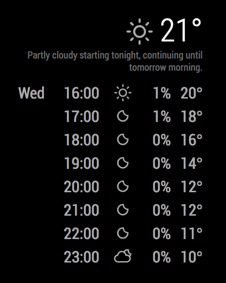

# MMM-darksky-hourly
This an extension for [MagicMirror](https://github.com/MichMich/MagicMirror) that adds localized weather using the [Dark Sky API](https://darksky.net/dev/) (originally Forecast.io) -- the same service that powers the [Dark Sky App](https://darksky.net/app/).



This is a heavily modified version of [MMM-forecast-io](https://github.com/dmcinnes/MMM-forecast-io) that aims to present current and hourly information on temperature and likelihood of rain.

## Using the module

To use this module, add it to the modules array in the `config/config.js` file:
````javascript
modules: [
  {
    module: 'MMM-darksky-hourly',
    position: 'top_right',  // This can be any of the regions.
    config: {
      // See 'Configuration options' for more information.
      apiKey: 'abcde12345abcde12345abcde12345ab', // Dark Sky API key.
      latitude:   16.77532,
      longitude: -3.008265
    }
  }
]
````

## Configuration options

<table width="100%">
  <!-- table suffering... -->
  <thead>
    <tr>
      <th>Option</th>
      <th width="100%">Description</th>
    </tr>
  <thead>
  <tbody>
    <tr>
      <td><code>apiKey</code></td>
      <td>The <a href="https://darksky.net/dev/" target="_blank">Dark Sky API</a> key, which can be obtained by creating an Dark Sky API account.<br>
        <br> This value is <b>REQUIRED</b>
      </td>
    </tr>
    <tr>
      <td><code>units</code></td>
      <td>What units to use. Specified by config.js<br>
        <br><b>Possible values:</b> <code>config.units</code> = Specified by config.js, <code>default</code> = Kelvin, <code>metric</code> = Celsius, <code>imperial</code> =Fahrenheit
        <br><b>Default value:</b> <code>config.units</code>
      </td>
    </tr>
    <tr>
      <td><code>twentyFourHourTime</code></td>
      <td>Whether to use 24-hour format time or not<br>
        <br><b>Possible values:</b> <code>true</code> = Time presented as XX:00, <code>false</code> = Time present as XXam/pm
        <br><b>Default value:</b> <code>true</code>
      </td>
    </tr>
    <tr>
      <td><code>showPrecipitationPossibilityInRow</code></td>
      <td>Show chance of precipitation at each hour<br>
        <br><b>Possible values:</b> <code>true</code> = Display precipitation possibility, <code>false</code> = Do not display precipitation details
        <br><b>Default value:</b> <code>true</code>
      </td>
    </tr>
    <tr>
      <td><code>showDayInRow</code></td>
      <td>Show day that hour occurs in<br>
        <br><b>Possible values:</b> <code>true</code> = Display day in row, <code>false</code> = Do not display day in row
        <br><b>Default value:</b> <code>true</code>
      </td>
    </tr>
    <tr>
      <td><code>showIconInRow</code></td>
      <td>Show weather icon in each hourly row<br>
        <br><b>Possible values:</b> <code>true</code> = Display icon in row, <code>false</code> = Do not display icon in row
        <br><b>Default value:</b> <code>true</code>
      </td>
    </tr>
    <tr>
      <td><code>fadeForecast</code></td>
      <td>Toggles fading of the last two forecast rows.<br>
        <br><b>Default value:</b>  <code>true</code>
      </td>
    </tr>
    <tr>
      <td><code>showCurrentWeather</code></td>
      <td>Toggles display of current weather (icon + temperature).<br>
        <br><b>Default value:</b>  <code>true</code>
      </td>
    </tr>
    <tr>
      <td><code>showTextSummary</code></td>
      <td>Toggles display of weather text summary.<br>
        <br><b>Default value:</b>  <code>true</code>
      </td>
    </tr>
    <tr>
      <td><code>language</code></td>
      <td>The language of the weather text.<br>
        <br><b>Possible values:</b> <code>en</code>, <code>nl</code>, <code>ru</code>, etc ...
        <br><b>Default value:</b> uses value of <i>config.language</i>
      </td>
    </tr>
    <tr>
      <td><code>updateInterval</code></td>
      <td>How often does the content needs to be fetched? (Milliseconds)<br>
        <br>Forecast.io enforces a 1,000/day request limit, so if you run your mirror constantly, anything below 90,000 (every 1.5 minutes) may require payment information or be blocked.<br>
        <br><b>Possible values:</b> <code>1000</code> - <code>86400000</code>
        <br><b>Default value:</b> <code>600000</code> (10 minutes)
      </td>
    </tr>
    <tr>
      <td><code>animationSpeed</code></td>
      <td>Speed of the update animation. (Milliseconds)<br>
        <br><b>Possible values:</b><code>0</code> - <code>5000</code>
        <br><b>Default value:</b> <code>2000</code> (2 seconds)
      </td>
    </tr>
    <tr>
      <td><code>initialLoadDelay</code></td>
      <td>The initial delay before loading. If you have multiple modules that use the same API key, you might want to delay one of the requests. (Milliseconds)<br>
        <br><b>Possible values:</b> <code>1000</code> - <code>5000</code>
        <br><b>Default value:</b>  <code>0</code>
      </td>
    </tr>
    <tr>
      <td><code>retryDelay</code></td>
      <td>The delay before retrying after a request failure. (Milliseconds)<br>
        <br><b>Possible values:</b> <code>1000</code> - <code>60000</code>
        <br><b>Default value:</b>  <code>2500</code>
      </td>
    </tr>
    <tr>
      <td><code>latitude</code></td>
      <td>The latitude location in decimal. Set this (and <code>longitude</code>) as the location for the forecast. If this is not set, the module will attempt to approximate using browser geolocation.<br>
        <br><b>Example value:</b> <code>16.77532</code>
        <br><b>Default value:</b>  <code>null</code>
      </td>
    </tr>
    <tr>
      <td><code>longitude</code></td>
      <td>The longitude location in decimal. Set this (and <code>latitude</code>) as the location for the forecast. If this is not set, the module will attempt to approximate using browser geolocation.<br>
        <br><b>Example value:</b> <code>-3.008265</code>
        <br><b>Default value:</b>  <code>null</code>
      </td>
    </tr>
    <tr>
      <td><code>apiBase</code></td>
      <td>The Dark Sky API base URL.<br>
        <br><b>Default value:</b>  <code>'https://api.darksky.net/forecast'</code>
      </td>
    </tr>
    <tr>
      <td><code>maxHoursForecast</code></td>
      <td>Limit how many hours of weather forecast.<br>
        <br><b>Default value:</b>  <code>8</code>
      </td>
    </tr>
    <tr>
      <td><code>skipHours</code></td>
      <td>Set how many hours should be skiped between two rows.<br>
        <br><b>Example value:</b> <code>1</code>
		<br>This will show every other hour (e.g. 3, 5, 7 ...)
        <br><b>Default value:</b>  <code>0</code>
      </td>
    </tr>
    <tr>
      <td><code>iconTable</code></td>
      <td>The conversion table to convert the weather conditions to weather-icons.<br>
        <br><b>Default value:</b><pre>iconTable: {
      'clear-day':           'wi-day-sunny',
      'clear-night':         'wi-night-clear',
      'rain':                'wi-rain',
      'snow':                'wi-snow',
      'sleet':               'wi-rain-mix',
      'wind':                'wi-cloudy-gusts',
      'fog':                 'wi-fog',
      'cloudy':              'wi-cloudy',
      'partly-cloudy-day':   'wi-day-cloudy',
      'partly-cloudy-night': 'wi-night-alt-cloudy',
      'hail':                'wi-hail',
      'thunderstorm':        'wi-thunderstorm',
      'tornado':             'wi-tornado'
    }</pre>
      </td>
    </tr>
  </tbody>
</table>
